# Automating 3D Dataset Generation with Neural Radiance Fields

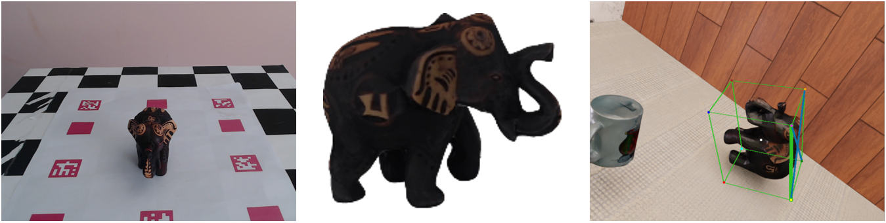

Authors: **Paul Schulz** (OVGU Magdeburg)   **Thorsten Hempel** (OVGU Magdeburg)   **Ayoub Al-Hamadi** (OVGU Magdeburg)  

##  Key Contributions

✅ **End-to-end automated dataset generation pipeline for monocular 3D Detection/6D Pose Estimation**  
✅ **Combines mesh creation via Neural Rendering and SoTA synthetic datset generation to create datasets for arbitrary complex objects**  
✅ **Capable of training performant 6D pose estimation models**  
✅ **Requires minimal resources and manual intervention**  

---
## 📌 Pipeline Overview
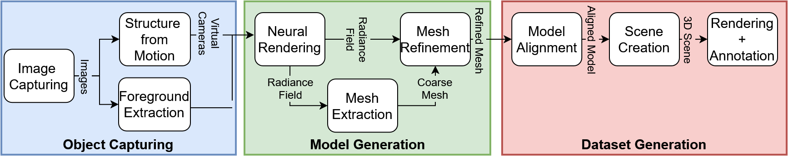

### 1️⃣ **Object Capturing**
- Capturing 2D images of the target object using a **rotating plate** and a **static camera**  
- Using **Structure from Motion (SfM)** for camera pose estimation 
- Applying **foreground extraction** for object segmentation  

### 2️⃣ **Model Generation**
- Training a **Radiance Field** to create **meshes**  
- Refining meshes for high fidelity through **vertex and face optimization**  
- Mapping of  **diffuse texture** to generate **textured mesh** 

### 3️⃣ **Synthetic Dataset Generation**
- Creating **3D scenes** with virtual cameras, lighting, and background variations  
- Performing **automated annotation** (bounding boxes, segmentation, etc.)  
- Generating diverse datasets for **robust training of pose estimation models** 

---

## 🎯 Results

  
 <strong>  1️⃣ Object Capturing</strong>

  
 <strong>2️⃣ Model Generation</strong>

  Radiance Fields
        <table>
          <tr>
            <td>
              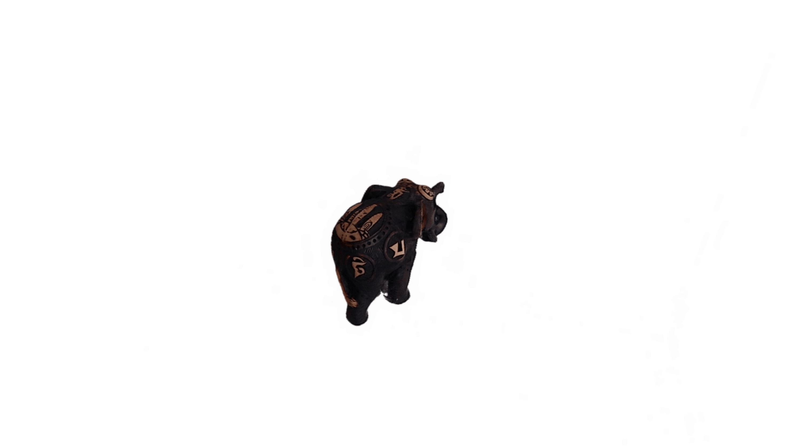
            </td>
            <td>
              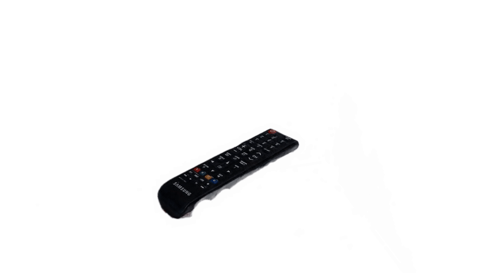
            </td>
            <td>
              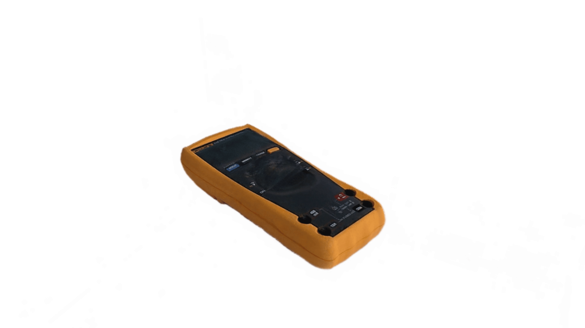
            </td>
          </tr>
      </table>
    Meshes
        <table>
          <tr>
            <td>
              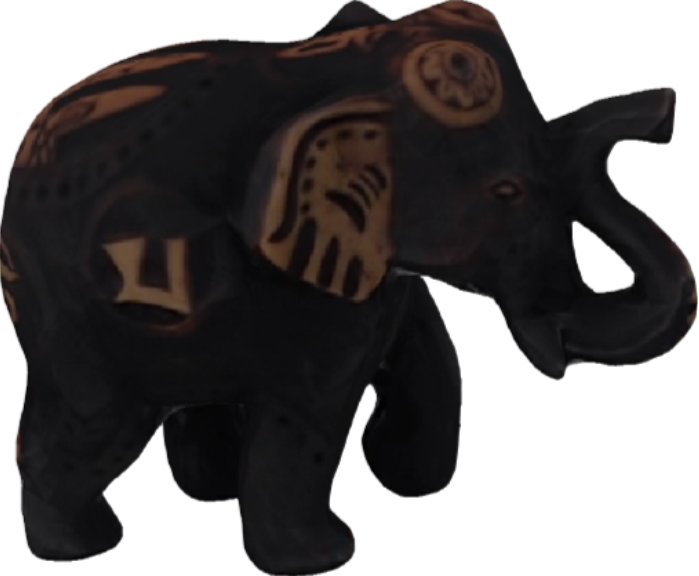
            </td>
            <td>
              
            </td>
            <td>
              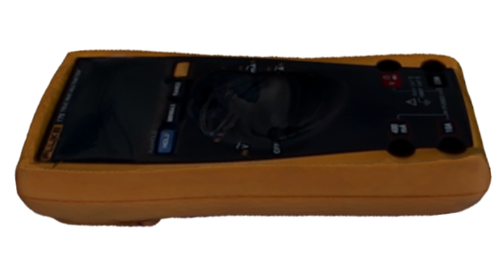
            </td>
          </tr>
      </table>

      

  
 <strong>3️⃣ Synthetic Dataset Generation</strong>

        Bounding Box Modalities
          <table>
            <tr>
              <td>
                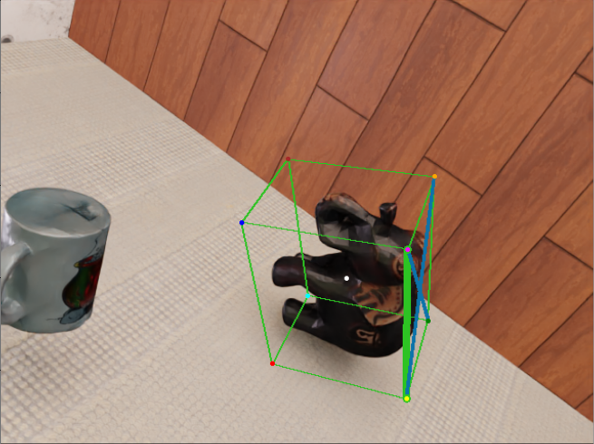
              </td>
              <td>
                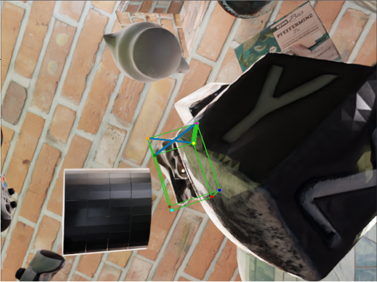
              </td>
              <td>
                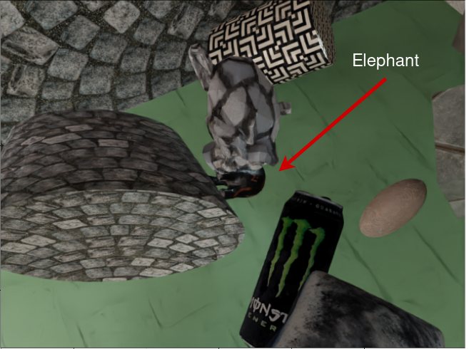
              </td>
            </table>
      Light Variations
        <table>
            <td>
              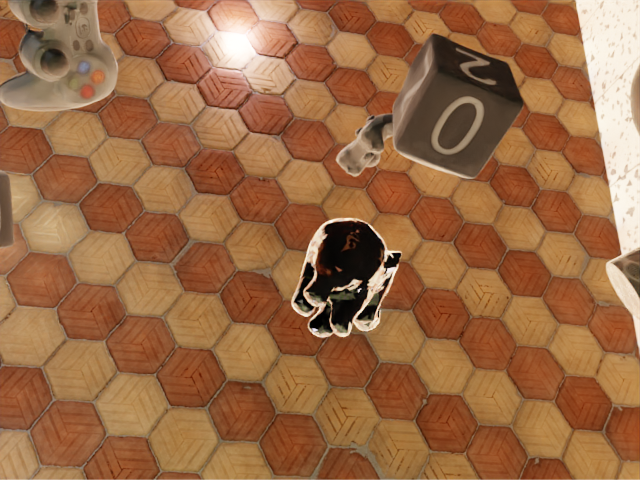
            </td>
            <td>
              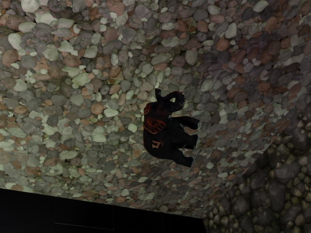
            </td>
            <td>
              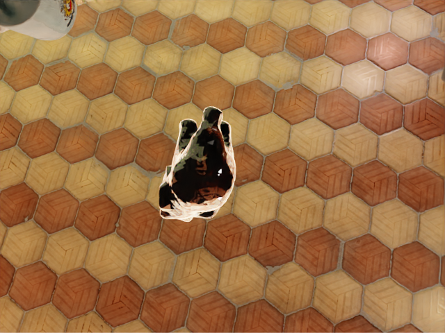
            </td>
          </tr>
      </table>

  
 <strong>4️⃣ Inference Results </strong>

  <table>
  <tr>
    <td>
      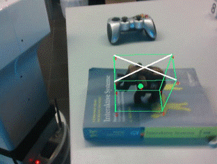
    </td>
    <td>
      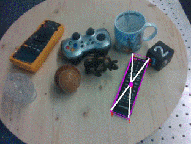
    </td>
    <td>
      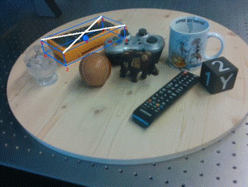
    </td>
  </tr>
</table>

